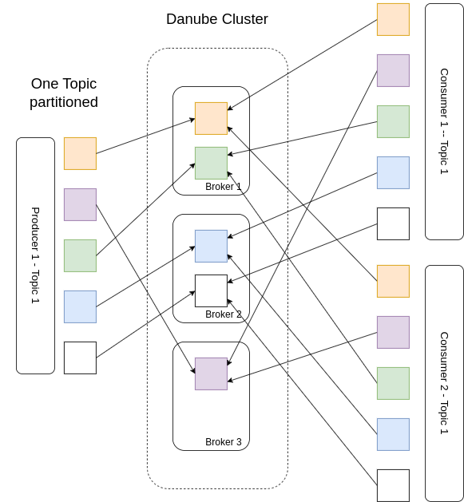

# Topic

A topic is a unit of storage that organizes messages into a stream. As in other pub-sub systems, topics are named channels for transmitting messages from producers to consumers. Topic names are URLs that have a well-defined structure:

## /{namespace}/{topic_name}

Example: **/default/markets** (where *default* is the namespace and *markets* the topic)

⚠️ The partitioned topics feature is under development, as for now it support only non-partitioned topics, check the examples.

## Partitioned Topics

All Danube topics are partitioned topics. The **non-partitioned topics** are under the hood a topic with a single parition. The non-partitioned topics are served by a single broker, which limits the maximum throughput of the topic. The partitioned topic has more partitiones that are handled by multiple brokers within the cluster, thus allowing for higher throughput.

A partitioned topic is implemented as N internal topics, where N is the number of partitions. When publishing messages to a partitioned topic, each message is routed to one of several brokers. The distribution of partitions across brokers is handled automatically.

Messages for the topic are broadcast to two consumers. The **routing mode** determines each message should be published to which partition, while the **subscription type** determines which messages go to which consumers.

### Benefits of the Partitioned topics

* `Scalability`: Partitioned topics enable horizontal scaling by distributing the load across multiple partitions. This is essential for high-throughput systems that need to handle large volumes of data efficiently.
* `Parallel Processing`: It allows multiple consumers to process different partitions of the same topic concurrently, improving throughput and processing efficiency.
* `Data Locality`: Partitioning can help in maintaining data locality and reducing processing latency, as consumers handle a specific subset of the data (key-shared distribution).

### Creation of Partitioned Topics

* `Static Creation`: Partitioned topics are created with a predefined number of partitions. When you create a partitioned topic, you specify the number of partitions it should have. This number remains fixed for the lifetime of the topic, although you can configure this number at topic creation time.
* `Dynamic Scaling`: Not supported Yet

## Producers

The producers **routing mechanism** determine which messages go to which partition.

### Routing modes

When publishing to partitioned topics, you must specify a routing mode. The routing mode determines each message should be published to which partition or which internal topic.

* **RoundRobinPartition** - The producer will publish messages across all partitions in round-robin fashion to achieve maximum throughput. If a key is specified on the message, the partitioned producer will **hash the key and assign message to a particular partition**.
* **SinglePartition** - If no key is provided, the producer will randomly pick one single partition and publish all the messages into that partition. While if a key is specified on the message, the partitioned producer will hash the key and assign message to a particular partition.

## Consumers (subscriptions)

The **subscription type** determines which messages go to which consumers.

Check the [Subscription documentation](subscriptions.md) for details on how messages are distributed to consumers based on the subscription type.
