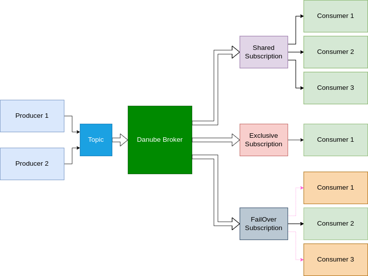

# Use Danube Rust cient

The Danube permits multiple topics and subcriber to the same topic. The [Subscription Types](../../architecture/Queuing_PubSub_messaging.md) can be combined to obtain message queueing or fan-out pub-sub messaging patterns.



## Producer

A producer is a process that attaches to a topic and publishes messages to a Danube broker. The Danube broker processes the messages.

**Access Mode** is a mechanism to determin the permissions of producers on topics.

* **Shared** - Multiple producers can publish on a topic.
* **Exclusive** - If there is already a producer connected, other producers trying to publish on this topic get errors immediately.

### Example

```rust
let topic = "/default/test_topic".to_string();

let json_schema = r#"{"type": "object", "properties": {"field1": {"type": "string"}, "field2": {"type": "integer"}}}"#.to_string();

let mut producer = client
        .new_producer()
        .with_topic(topic)
        .with_name("test_producer1")
        .with_schema("my_app".into(), SchemaType::Json(json_schema))
        .build();

let prod_id = producer.create().await?;
info!("The Producer was created with ID: {:?}", prod_id);

let data = json!({
            "field1": format!{"value{}", i},
            "field2": 2020+i,
        });

// Convert to string and encode to bytes
let json_string = serde_json::to_string(&data).unwrap();
let encoded_data = json_string.as_bytes().to_vec();

// let json_message = r#"{"field1": "value", "field2": 123}"#.as_bytes().to_vec();
let message_id = producer.send(encoded_data).await?;
println!("The Message with id {} was sent", message_id);
```

## Consumer

A consumer is a process that attaches to a topic via a subscription and then receives messages.

**Subscription Types** - describe the way the consumers receive the messages from topics

* **Exclusive** -  Only one consumer can subscribe, guaranteeing message order.
* **Shared** -  Multiple consumers can subscribe, messages are delivered round-robin, offering good scalability but no order guarantee.
* **Failover** - Similar to shared subscriptions, but multiple consumers can subscribe, and one actively receives messages.

### Example

```rust
let topic = "/default/test_topic".to_string();

    let mut consumer = client
        .new_consumer()
        .with_topic(topic.clone())
        .with_consumer_name("test_consumer")
        .with_subscription("test_subscription")
        .with_subscription_type(SubType::Exclusive)
        .build();

    // Subscribe to the topic
    let consumer_id = consumer.subscribe().await?;
    println!("The Consumer with ID: {:?} was created", consumer_id);

    let _schema = client.get_schema(topic).await.unwrap();

    // Start receiving messages
    let mut message_stream = consumer.receive().await?;

     while let Some(message) = message_stream.next().await {
        //process the message and ack for receive
     }
```

## Complete example

For a complete example implementation of the above code using producers and consumers, check the [Examples folder](https://github.com/danrusei/danube/tree/main/danube-client/examples).
